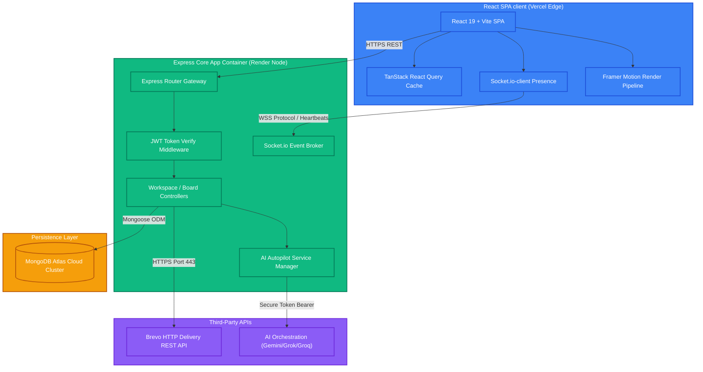
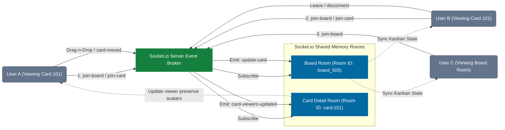

# Zenith Workspace - Enterprise Task Management Platform

Zenith Workspace is an enterprise-grade, high-fidelity collaboration and task management platform built on the MERN (MongoDB, Express, React, Node.js) stack. The system is designed with a luxury glassmorphic design language, real-time collaboration engines, dual-stage security authorization, and pluggable Large Language Model (LLM) copilot assistants.

This document serves as the master guide for the entire project, explaining the architecture, core execution flows, database schema relationships, and deployment pipelines.

---

## System Architecture

Zenith separates client-side presentation from backend state operations, syncing updates instantly across active collaborative nodes.



---

## Core Execution Flows Explained

This section details how the primary features of the platform operate behind the scenes.

### 1. Authentication and Registration Flow
To prevent unverified accounts from cluttering the system, Zenith utilizes a two-stage registration pipeline.
- **Stage 1 (Sign Up)**: When a user registers, their account is initially created in an unverified state (`isVerified: false`). A 6-digit One-Time Password (OTP) is generated, hashed, saved to the database, and dispatched to their email address via the Brevo HTTP API.
- **Self-Healing Re-Registration**: If a user attempts to sign up again with the same email but has not yet completed verification, the system does not fail. Instead, it generates a fresh OTP, resets the expiration timer, sends a new email, and instructs the client to redirect to the verification screen.
- **Stage 2 (Verification)**: The user enters the 6-digit code. The server verifies it against the database and checks that it has not expired. Upon success, the account is marked verified (`isVerified: true`), the OTP field is wiped, and a JSON Web Token (JWT) is returned to establish the session.

```# mermaid
sequenceDiagram
    autonumber
    actor User as Client Web Browser
    participant API as Express Auth Router
    participant DB as MongoDB Atlas
    participant Email as Brevo HTTP Service

    User->>API: POST /api/auth/register (Email, Pass)
    API->>DB: Query existing users by email
    
    alt User exists but unverified (OTP pending)
        DB-->>API: User Record (isVerified: false)
        API->>DB: Generate fresh 6-digit OTP & extend TTL
        API->>Email: POST /v3/smtp/email (Send Verification Code)
        Email-->>API: HTTP 200 OK (Sent)
        API-->>User: HTTP 200 OK (OTP Sent to Email - Redirect to /verify)
    else User is new
        API->>DB: Save User Document (isVerified: false, otpCode)
        API->>Email: POST /v3/smtp/email (Send Verification Code)
        Email-->>API: HTTP 200 OK (Sent)
        API-->>User: HTTP 201 Created (Redirect to /verify)
    else User is already verified
        DB-->>API: User Record (isVerified: true)
        API-->>User: HTTP 400 Bad Request ("User already registered")
    end

    Note over User, API: Verification Screen Phase
    User->>API: POST /api/auth/verify-otp (Email, Code)
    API->>DB: Verify matching code & TTL validation
    
    alt Code Matches & Valid Time
        API->>DB: Update User Document (isVerified: true, otpCode: null)
        API-->>User: HTTP 200 OK (JWT Session Token Granted)
    else Code Mismatch / Expired
        API-->>User: HTTP 400 Bad Request ("Invalid or expired verification code")
    end
```

### 2. Real-Time Kanban Synchronization
Every kanban board is mapped to a unique room inside Socket.io (`boardId`).
- **Drag-and-Drop Action**: When a user drags a task card from one list column to another, the client immediately updates its local UI for smooth feedback. It then broadcasts a `card-moved` event containing the card details and position data to the server.
- **State Broadcast**: The Socket.io broker intercepts this event and transmits the update to all active socket connections joined to the same `boardId` room (except the sender). Receiving clients catch this event and update their local TanStack Query cache dynamically, syncing the board without requiring manual page refreshes.

### 3. Active Collaborator Presence
To avoid collisions when multiple users edit the same card, Zenith tracks focus states in real time.
- **Card Focus**: When a user opens a card modal, a `join-card` socket event is dispatched containing the board ID, card ID, and the current user's profile metadata.
- **Tracking List**: The server keeps an active in-memory map of card viewers (`cardId -> list of active socket viewers`). When a user joins or leaves a card, this list is updated, and a `card-viewers-updated` event is broadcast to the parent board.
- **UI Avatars**: The board view listens to this event and displays small, floating avatars of active viewers beside the card title, updating dynamically.



### 4. Pluggable AI Service Pipeline
The application features context-aware task assistance through third-party LLM integrations.
- **AI Subtask Generation**: When a user requests subtasks for a card, the system extracts the card title and description. It constructs a structured prompt, requiring the output format to be a clean JSON array of action items.
- **API Multiplexing**: The backend checks for active API keys in order of precedence: xAI Grok, Groq (Llama-3), and Google Gemini. If keys are present, the request is dispatched over HTTPS. If no keys are present, a local rule-based smart parser generates fallback subtasks based on keyword patterns.
- **Database Append**: The returned subtasks are parsed, appended to the card's Mongoose document, and saved. The server then triggers a socket broadcast so other board viewers see the subtasks pop up instantly.

---

## Project Structure

```
Task-Management-App/
├── client/              # React Single-Page Application (Vite + Tailwind CSS 4)
│   ├── src/             
│   │   ├── features/    # Encapsulated feature domains (auth, workspace, command, settings)
│   │   ├── services/    # WebSocket connection management and API client layers
│   │   └── index.css    # Layout properties and glassmorphic color variables
│   ├── vercel.json      # Rewrites routing config for Vercel
│   └── README.md        # Frontend-specific implementation details
│
├── backend/             # Express API Server and WebSocket Broker
│   ├── config/          # Database orchestrations and templates
│   ├── models/          # Mongoose database schemas
│   ├── routes/          # RESTful endpoint boundaries
│   ├── sockets/         # WebSocket room handlers and presence mappings
│   ├── services/        # AI engines, mail adapters, and business logic
│   └── README.md        # Backend-specific architecture details
│
├── render.yaml          # Infrastructure as Code deployment configuration
└── README.md            # Overall project documentation (this file)
```

---

## Development Setup and Deployment Playbook

For step-by-step instructions on setting up environment variables, running local test servers, or deploying to production hosting services, please consult the targeted component guides:

- **Backend Configuration & APIs**: [backend/README.md](backend/README.md)
- **Frontend Client & UI Compilation**: [client/README.md](client/README.md)

---

## Core Security Architectures

- **Dynamic CORS Whitelisting**: Rather than allowing wildcard access, the Express CORS middleware inspects incoming origin headers dynamically. It verifies them against configured production domains, preventing unauthorized cross-origin requests.
- **Bypass Port Throttling**: Outbound transaction emails utilize Brevo's HTTPS API over port `443` rather than standard SMTP ports `465/587`. This bypasses port-blocking mechanisms found in modern container host networks (e.g. Render, AWS Fargate).
- **Encapsulated Secrets**: All critical API credentials, JWT signers, and database connection strings are managed as environment variables on the hosting platform and are never compiled into the public client application.
