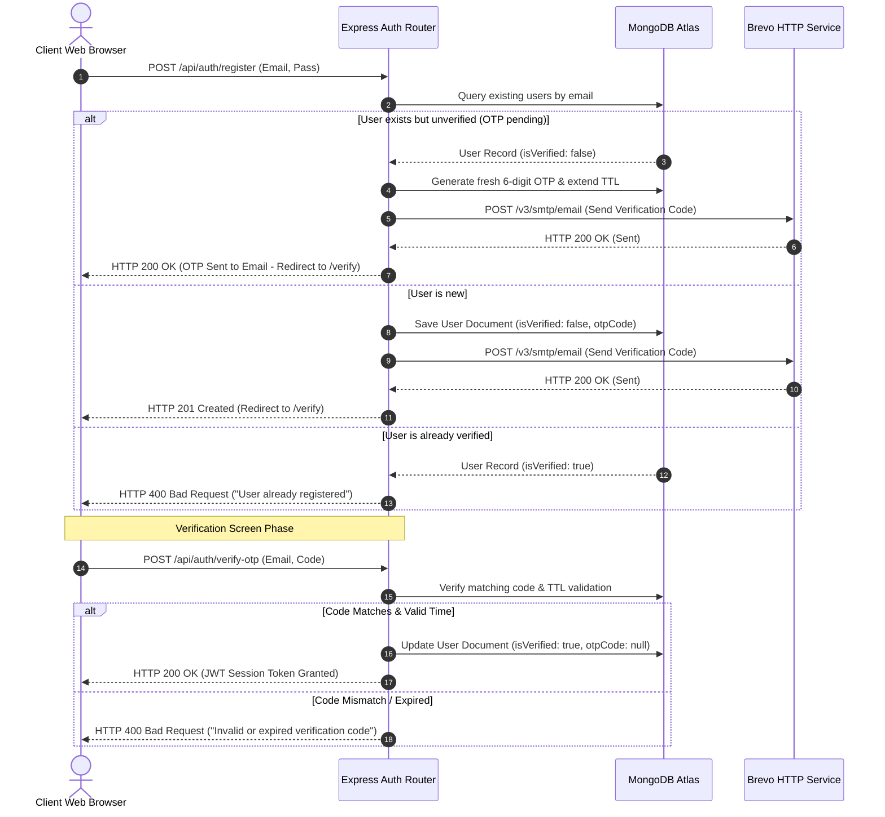
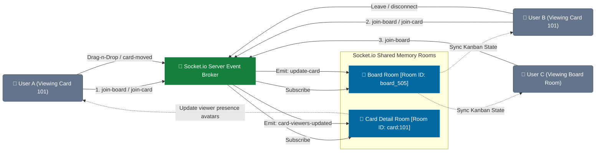

# 🌌 Zenith Workspace — Enterprise Task Management Platform

[](https://mongodb.com)
[](https://socket.io)
[](https://deepmind.google/technologies/gemini/)
[](#)

Zenith Workspace is an enterprise-grade, high-fidelity collaboration and task management system built on the MERN stack. Designed with a luxury glassmorphic design language, Zenith implements state-of-the-art real-time collaboration engines, dual-stage security authorization (JWT + REST OTP), and pluggable LLM copilots.

---

## 📐 System Architecture

Zenith separates client-side presentation from backend state operations, syncing updates instantly across active collaborative nodes.

```mermaid
graph TD
    %% Styling Classes
    classDef client fill:#3b82f6,stroke:#1d4ed8,stroke-width:2px,color:#fff;
    classDef backend fill:#10b981,stroke:#047857,stroke-width:2px,color:#fff;
    classDef database fill:#f59e0b,stroke:#b45309,stroke-width:2px,color:#fff;
    classDef external fill:#8b5cf6,stroke:#6d28d9,stroke-width:2px,color:#fff;

    %% Frontend Stack
    subgraph Client ["🎨 React SPA client (Vercel Edge)"]
        SPA["React 19 + Vite SPA"]
        RQ["TanStack React Query Cache"]
        SIOC["Socket.io-client Presence"]
        FM["Framer Motion Render Pipeline"]
        SPA --> RQ
        SPA --> SIOC
        SPA --> FM
    end
    class Client,SPA,RQ,SIOC,FM client;

    %% Backend Gateway
    subgraph Backend ["⚙️ Express Core App Container (Render Node)"]
        RT["Express Router Gateway"]
        Auth["JWT Token Verify Middleware"]
        SIOS["Socket.io Event Broker"]
        Controllers["Workspace / Board Controllers"]
        AIService["AI Autopilot Service Manager"]
        
        RT --> Auth
        Auth --> Controllers
        Controllers --> AIService
    end
    class Backend,RT,Auth,SIOS,Controllers,AIService backend;

    %% Data & External Layers
    subgraph Data ["🗄️ Persistence Layer"]
        MDB[("MongoDB Atlas Cloud Cluster")]
    end
    class Data,MDB database;

    subgraph External ["🔌 Third-Party APIs"]
        Brevo["Brevo HTTP Delivery REST API"]
        LLM["AI Orchestration (Gemini/Grok/Groq)"]
    end
    class External,Brevo,LLM external;

    %% Network Connections
    SPA -- HTTPS REST -- RT
    SIOC -- WSS Protocol / Heartbeats -- SIOS
    Controllers -- Mongoose ODM -- MDB
    Controllers -- HTTPS (Port 443) -- Brevo
    AIService -- Secure Token Bearer -- LLM
```

---

## 🔑 Authentication & OTP Verification Flow

Zenith enforces a dual-stage authentication pipeline to verify email addresses before users can access workspaces. Rather than failing on re-registration, the backend transparently triggers an OTP refresh.



---

## 📡 Live Board Synchronization & Presence Rooms

Zenith coordinates drag-and-drop actions and user locations through scoped room architectures in Socket.io.



---

## 📂 Project Architecture

```
Task-Management-App/
├── client/              # Single-Page Application (React 19, Vite, Tailwind CSS 4)
│   ├── src/             
│   │   ├── features/    # Module domain boundaries (auth, workspace, command, settings)
│   │   ├── services/    # WebSocket handlers and axios interceptors
│   │   └── index.css    # Global utility structures & glassmorphic tokens
│   ├── vercel.json      # Client production rewrite routing configuration
│   └── README.md        # Frontend-specific implementation details
│
├── backend/             # Enterprise API Server (Express Core & Sockets)
│   ├── config/          # Database orchestrations and templates
│   ├── models/          # Structured Mongoose Schemas (Workspace, Board, Card, User)
│   ├── routes/          # RESTful Endpoint boundaries
│   ├── sockets/         # WebSocket room controllers and presence maps
│   ├── services/        # AI engines, Mail routing, Auth logic
│   └── README.md        # Backend-specific architecture details
│
├── render.yaml          # Infrastructure as Code deployment descriptor
└── README.md            # Master overview (this file)
```

---

## 🏁 Development Setup & Deployment Playbook

For comprehensive local and production installation instructions, please refer to the targeted component documentations:

*   📖 **Backend Server Configuration**: [backend/README.md](backend/README.md)
*   📖 **Frontend Client Configuration**: [client/README.md](client/README.md)

---

## 🛡️ Enterprise Security Implementations

*   **Dynamic CORS Whitelisting**: The Express middleware queries origin headers dynamically, matching requests against verified regular expression arrays to secure REST and WebSockets from malicious cross-origin execution.
*   **Bypass Port Throttling**: Outbound transaction emails utilize Brevo's HTTPS API over port `443` rather than standard SMTP ports `465/587`. This bypasses port-blocking mechanisms found in modern container host networks (e.g. Render, AWS Fargate).
*   **Encapsulated Environments**: Critical secret configurations (JWT secrets, DB credentials, SMTP API keys) are secured within system environment keys and never loaded inside client runtimes.
