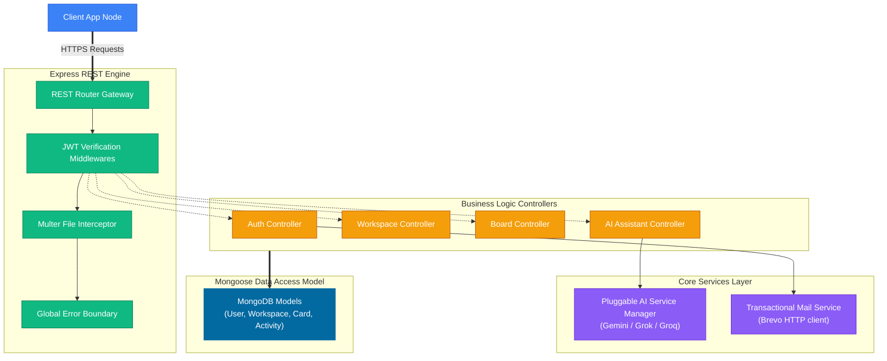
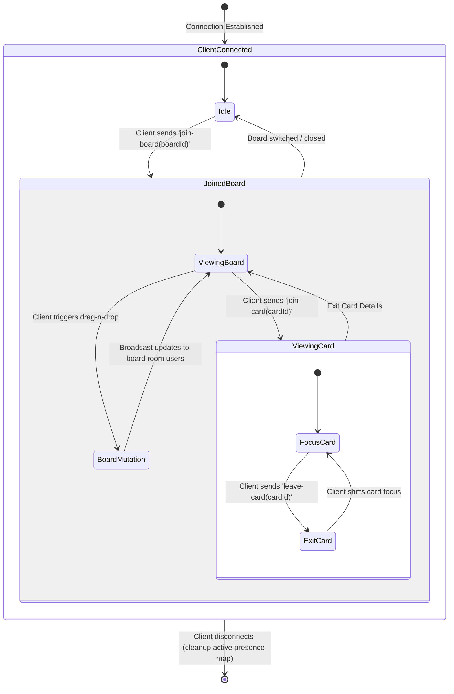

# Zenith Backend - API Server and Real-Time Orchestrator

This repository hosts the Express web API server and Socket.io WebSocket orchestrator powering the Zenith Workspace. It manages state transitions, real-time presence rooms, transaction routing, database access pipelines, and AI copilot agents.

---

## Tech Architecture and Operations

The backend runs on Node.js using ES Modules (`import/export` syntax) and interfaces with MongoDB Atlas for persistent storage.



---

## Core Operational Pipelines

This section details how developers can understand the backend's key functional layers.

### 1. Database Schema Configurations
Zenith uses strict Mongoose models located in `models/` to represent data boundaries:
- **User**: Tracks credentials, verified status, and OTP codes with validation timestamps.
- **Workspace**: Groups related boards and lists members with authorization roles (owner, member).
- **Board**: Belongs to a workspace, containing layout templates.
- **List**: Represents card columns (e.g., Todo, In Progress, Done) containing reference arrays to cards.
- **Card**: Holds titles, descriptions, due dates, checklists, comments, assignees, and attachment directories.
- **Activity**: Records audit logs of actions taken within a board (e.g., card movements, AI modifications).

### 2. Error Handling & Validation
The server uses a centralized error-handling flow:
- All route actions are wrapped in `asyncHandler` wrappers to catch promise rejections.
- A global `errorMiddleware` in `middleware/errorMiddleware.js` parses exceptions. If an error contains a defined status code, it returns a structured JSON error response. Otherwise, it defaults to a standard 500 response and logs the stack trace in development mode.

---

## Security Gateways and CORS Rules

The backend server features strict security policies:
1.  **Dynamic CORS Validation**: Matches request origins dynamically against verified regular expressions to guarantee that production frontend URLs can access resources without exposing API gateways to wildcard access.
2.  **State-Gated Auth**: All workspace, board, and card operations are guarded by a JWT authentication middleware (`backend/middleware/authMiddleware.js`), extracting headers and checking token structures.
3.  **Encapsulated Secrets**: Secrets are parsed at launch. Fallbacks are included to handle development states cleanly.

---

## API Reference Specs

### Authentication Pipelines (`/api/auth`)

| Method | Endpoint | Auth | Request Payload Details |
| :--- | :--- | :--- | :--- |
| `POST` | `/register` | None | `{ name, email, password }` |
| `POST` | `/verify-otp`| None | `{ email, otpCode }` |
| `POST` | `/resend-otp`| None | `{ email }` |
| `POST` | `/login` | None | `{ email, password }` |

### Workspace Operations (`/api/workspaces`)

| Method | Endpoint | Auth | Description |
| :--- | :--- | :--- | :--- |
| `GET` | `/` | JWT | Fetch all workspaces user belongs to |
| `POST` | `/` | JWT | Create a new workspace |
| `GET` | `/:id` | JWT | Fetch workspace metadata |
| `PUT` | `/:id` | JWT | Update workspace properties |
| `DELETE`| `/:id` | JWT | Purge workspace and dependent boards |

### Boards and Lists (`/api/boards`, `/api/lists`)

| Method | Endpoint | Auth | Description |
| :--- | :--- | :--- | :--- |
| `GET` | `/workspace/:workspaceId`| JWT | Fetch boards inside workspace |
| `POST` | `/` | JWT | Create a board from standard template |
| `GET` | `/:id` | JWT | Retrieve lists and cards of the board |

### AI Copilot Actions (`/api/ai`)

| Method | Endpoint | Auth | Description |
| :--- | :--- | :--- | :--- |
| `POST` | `/generate-subtasks` | JWT | Auto-generate checklists for card |
| `POST` | `/summarize-discussion` | JWT | Condense comments thread into bullets |

---

## WebSockets Presence Flow Chart

WebSocket rooms keep team members synced in real-time. Card presence tracking updates active avatar listings instantly when a user focus shifts.



---

## Environment Variables Config

Create a `.env` file in the root of the `/backend` folder:

```env
PORT=5000
NODE_ENV=development

# Database Access
MONGO_URI=mongodb+srv://<username>:<password>@cluster.mongodb.net/zenith

# Token Signatures
JWT_SECRET=your_super_secure_jwt_token_secret

# CORS Whitelist Origins
FRONTEND_URL=http://localhost:5173

# Brevo HTTP API Email configuration
BREVO_API_KEY=xkeysib-your_brevo_v3_api_key
BREVO_FROM_EMAIL=your_verified_brevo_sender@gmail.com
FROM_NAME="Zenith Workspace"

# Pluggable AI Service Configuration (Active key enables autopilot)
GEMINI_API_KEY=your_google_gemini_api_key
GROQ_API_KEY=your_groq_llama3_api_key
GROK_API_KEY=your_xai_grok_api_key
```

---

## Local Execution and Launch

1.  Navigate to folder: `cd backend`
2.  Install dependencies: `npm install`
3.  Launch Dev Mode: `npm run dev` (Runs under Nodemon for auto-restarts)
4.  Production Build Execution: `npm start`
