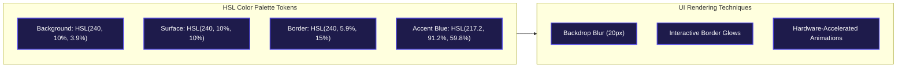
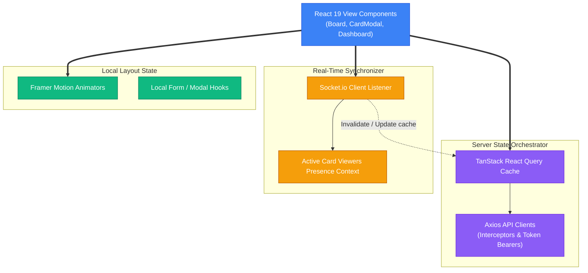

# Zenith Client - React SPA and UI System

Zenith Client is a Single-Page Application (SPA) built with React 19 and Vite. The user interface features custom HSL tokens, glassmorphism aesthetics, responsive layouts, real-time WebSocket state sync, and TanStack React Query caching pipelines.

---

## Design Tokens and UI Specs

Zenith uses custom HSL-tailored colors configured in Tailwind CSS 4 to support dark-mode themes:



---

## State Architecture and Caching

The application handles server state caching, local state transformations, and real-time socket events through a multi-tier state architecture:



---

## Core Frontend Implementation Details

This section outlines key operational details of the client codebases.

### 1. Unified State Synchronization
Zenith employs a hybrid state management model:
- **Server Data Lifecycle**: Managed by TanStack React Query. API responses are cached locally. When user actions update tasks (e.g., modifying card descriptions or comments), requests are dispatched via Axios, and React Query invalidates corresponding cache keys to trigger smart UI updates.
- **Dynamic Collaboration State**: WebSocket connections run continuously in the background. On board joins or drag events, socket updates bypass the standard fetch queue, updating the React Query cache store directly and immediately rendering the visual changes.

### 2. Modern CSS Architecture
Styling configuration is located in `src/index.css`:
- Standard values are configured as variables.
- Component layouts utilize backdrop blurs (`backdrop-blur-xl`), variable opacities, and responsive dimensions to maintain a clean layout from desktop viewports down to small mobile displays.

---

## Modular Directory Architecture

The frontend follows a domain-driven feature folder architecture:

```
client/
├── public/                 # Static visual assets
├── src/
│   ├── assets/             # Gradients, branding, background images
│   ├── components/         # Global shared UI elements (Buttons, Modals, Loader states)
│   ├── layouts/            # Shell templates (AppShell, DashboardLayout)
│   ├── services/           # Axios handlers and socket connection builders
│   ├── features/           # Modular Domain Boundaries
│   │   ├── auth/           # Login, registration, and OTP verification components
│   │   ├── workspace/      # Interactive Kanban boards, list columns, cards
│   │   ├── command/        # Command Menu (Ctrl + K) navigation system
│   │   └── analytics/      # Performance metrics and chart components
│   ├── index.css           # Core Tailwind CSS v4 variables & glassmorphic tokens
│   ├── App.jsx             # React routing and provider structures
│   └── main.jsx            # Application mount orchestrator
└── vercel.json             # Static hosting route configs
```

---

## Live Collaborator Presence Engine

Team members are displayed instantly on cards using the WebSocket state manager:
1.  **Mounting Card Modal**: Emits a `join-card` socket event containing details about the board, card, and user.
2.  **State Broadcasting**: Other users in the same board receive `card-viewers-updated` events, triggering live avatar rendering.
3.  **Unmounting / Closing**: Emits `leave-card`, removing the current user from active viewer states.
4.  **Network Disconnections**: If connections terminate unexpectedly, socket listeners automatically trigger cleanups on the server to prevent stale presence flags.

---

## Installation and Runs

### 1. Configure local variables
Create a `.env` file in the root of the `/client` folder:

```env
# Point to your local Node Express server:
VITE_API_URL=http://localhost:5000/api
VITE_SOCKET_URL=http://localhost:5000
```

### 2. Setup dependencies
```bash
npm install
```

### 3. Run Dev Mode (HMR Hot-Reloading)
```bash
npm run dev
```

### 4. Compile Production Builds
```bash
npm run build
```

---

## Performance Optimization Mechanics
*   **React Query Invalidation**: Rather than reloading page states, Zenith invalidates precise query keys (`['board', boardId]`) on card movements, minimizing network overhead.
*   **Presence Debouncing**: Rapid workspace transitions are filtered cleanly to prevent network overhead from WebSocket joins.
*   **Hardware Acceleration**: Motion elements run on compositor layers using Framer Motion styles, ensuring stable frame rates across mobile and desktop devices.
